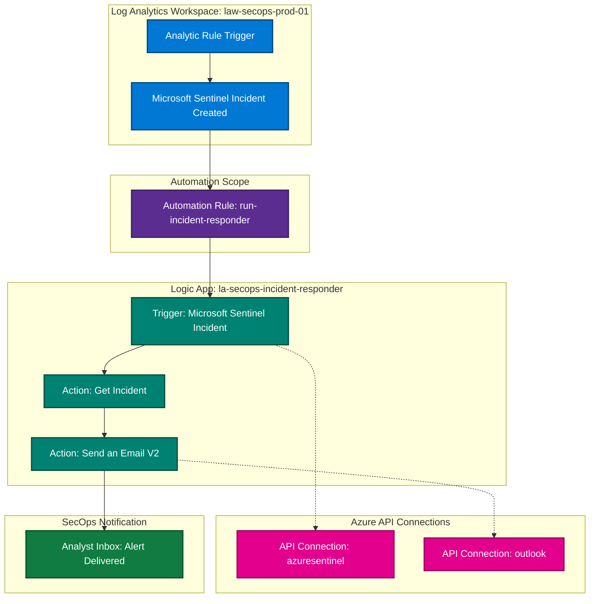

# Enterprise SecOps Automation: Microsoft Sentinel & Azure Logic Apps Incident Pipeline

## Executive Summary
This project demonstrates an enterprise-grade, Zero Trust-aligned security automation pipeline integrated within a Microsoft Sentinel Security Operations Center (SOC) framework. The architecture leverages event-driven Sentinel Automation Rules to trigger an Azure Logic App playbook (`la-secops-incident-responder`) for real-time incident processing and automated analyst notification. 

To govern cost predictability and prevent unexpected ingestion charges during testing, explicit workspace caps and retention guardrails were established. During deployment, after identifying portal abstraction limits and dynamic picker failures, a deliberate shift to ARM REST API payload tracing resolved schema parsing anomalies—updating the parameter mapping to `triggerBody()?['object']?['id']` to bring the pipeline to full operational status.

```
┌─────────────────────────┐      ┌──────────────────────────┐      ┌─────────────────────────┐
│  Microsoft Sentinel     │ ───> │ Sentinel Automation Rule │ ───> │  Azure Logic App        │
│  (Incident Generated)   │      │ `run-incident-responder` │      │  `la-secops-responder`  │
└─────────────────────────┘      └──────────────────────────┘      └─────────────────────────┘
                                                                               │
                                                                               ▼
┌─────────────────────────┐      ┌──────────────────────────┐      ┌─────────────────────────┐
│  Analyst Email Alert    │ <─── │  O365 Outlook Connector  │ <─── │  Get Incident Action    │
│  [STATUS: DELIVERED]    │      │  (Send an Email V2)      │      │  (Parsed via ARM ID)    │
└─────────────────────────┘      └──────────────────────────┘      └─────────────────────────┘
```

---

## Technical Architecture & Component Specifications

| Category | Component Name | Resource Type / Details |
| :--- | :--- | :--- |
| **Workspace** | `law-secops-prod-01` | Primary Log Analytics & Microsoft Sentinel Workspace |
| **Resource Group** | `rg-secops-prod-01` | Centralized SecOps Resource Group Scope |
| **Playbook (Logic App)** | `la-secops-incident-responder` | Serverless Workflow Engine (Consumption SKU) |
| **Automation Engine** | `run-incident-responder` | Sentinel Automation Rule (Trigger: *When incident is created*) |
| **Verification State** | `phase4_logicapp_successful_run` | Verified Operational State (Run Duration: 2.01s) |

---

## FinOps & Cost Governance Guardrails

To prevent run-away billing during SIEM testing and maintain enterprise cost governance, explicit limits were applied to the Log Analytics workspace (`law-secops-prod-01`):

* **Daily Ingestion Cap:** Strictly configured to **1 GB/day** to mitigate log ingestion floods during high-volume testing or unexpected diagnostic loops.
* **Data Retention Policy:** Set to **30 days** of active retention to stay within free-tier/low-cost boundaries while maintaining immediate diagnostic visibility.
* **Resource Optimization:** Playbook execution utilizes the serverless Consumption SKU, ensuring billing occurs exclusively per action execution ($0.00 while idle).

---

## System Architecture & Workflow Diagram



---

## Resource Visualizer & Dependency Map

The diagram below illustrates the active Azure Resource Group (`rg-secops-prod-01`) topology exported via Azure Resource Visualizer, highlighting key solution bindings and API connection dependencies:


---

## Enterprise Governance & Hierarchy


CAF Alignment: Demonstrates enterprise governance by housing centralized operational resources under the dedicated mg-management hierarchy under the Platform root.

Policy & Governance Scope: Ensures broad security monitoring policies and Azure Policy assignments applied to the Management group naturally cover sub-ent-platform-prod.

Resource Isolation: Keeps core operational logging separate from application workloads (mg-workloads) and identity resources (mg-identity).

## Deployment & Implementation Stages

### Phase 1: Foundation & Control Plane Setup
1. **Workspace & Resource Group Alignment:** Provisioned the core workspace `law-secops-prod-01` inside `rg-secops-prod-01`.

2. **Logic App Provisioning:** Deployed `la-secops-incident-responder` with standard Azure Sentinel API connectors.
3. **Action Chain Design:** Defined a workflow structure consisting of:
   * **Trigger:** `Microsoft Sentinel incident`
   * **Action 1:** `Get incident` (Retrieves full incident metadata)
   * **Action 2:** `Send an email (V2)` (Notifies SecOps team via Office 365 Outlook)

### Phase 2: Automation Rule Configuration
1. Created Sentinel Automation Rule `run-incident-responder`.
2. Set the trigger condition to **When incident is created**.
3. Configured rule actions to run the playbook `la-secops-incident-responder`.

### Phase 3: Anomaly Identification & Diagnostic Failures
* **Issue Observed:** Initial test incidents triggered the workflow, but execution failed at the **Get incident** step with an HTTP `400 BadRequest: Incident Arm ID missing`.
* **False Diagnostics from Manual Resubmits:** Manual execution attempts via the **Resubmit** button repeatedly failed because replaying historical runs sends static/null test payloads rather than active event triggers.

### Phase 4: Strategic Pivot to ARM REST API Payload Analysis
Recognizing that standard Azure Portal dynamic content pickers were dropping context due to UI abstraction limitations, a **deliberate pivot to raw REST API payload inspection** was executed—treating the trigger mechanism as an ARM API Playground request stream:


* **Raw Payload Discovery:** Exported and evaluated the incoming REST API JSON payload via the workflow's **Outputs Link** (`/contents/TriggerOutputs`):
  ```json
  {
    "body": {
      "objectSchemaType": "Incident",
      "objectEventType": "Create",
      "workspaceId": "5459abf0-b03a-4279-9add-03ba03e3edaf",
      "object": {
        "id": "/subscriptions/<REDACTED_SUBSCRIPTION_ID>/resourceGroups/rg-secops-prod-01/providers/Microsoft.OperationalInsights/workspaces/law-secops-prod-01/providers/Microsoft.SecurityInsights/Incidents/63883bf7-5be1-42f4-809a-0417943b837b",
        "name": "63883bf7-5be1-42f4-809a-0417943b837b",
        "properties": {
          "title": "dummm5",
          "severity": "High",
          "incidentNumber": 9
        }
      }
    }
  }
  ```
* **Root Cause & Resolution:** Identified that standard dynamic content pickers referenced invalid top-level keys (`triggerBody()?['incident']`). The API required the fully-qualified ARM Resource ID explicitly located at `"object" -> "id"`.
* **Dynamic Binding:** Configured the **Get incident** parameter **Incident ARM id** to use the exact expression:
  ```text
  triggerBody()?['object']?['id']
  ```

### Phase 5: Verification & Validation
1. Saved the updated Logic App workflow.
2. Triggered a fresh live test incident in Sentinel (`dummm5`, Incident #9).
3. Monitored **Run history**: Execution completed in **2.01 seconds** with a `Succeeded` status.


4. Confirmed notification delivery in THE ANALYST inbox.


---

## Enterprise Production Considerations & Scalability Gaps

While fully functional for laboratory validation, scaling this design to a production Enterprise SOC requires addressing the following architectural considerations:

1. **Unfiltered Automation Rule Scope (Notification Flooding):**
   * *Current State:* The automation rule `run-incident-responder` contains zero filter conditions, triggering the playbook on *every* incident created regardless of severity or analytic source.
   * *Production Remediation:* Implement scoping logic within the automation rule (e.g., condition filtering for `Severity == High/Critical` or specific `AnalyticRuleNames`) to prevent notification fatigue and analyst spam.

2. **Cross-Domain Email Authentication & Identity:**
   * *Current State:* Using personal/shared API connectors (`via outlook.com`) triggers external receiver spam filters (e.g., Gmail) due to domain alignment checks.
   * *Production Remediation:* Migrate notifications to an Azure Communication Services (ACS) resource or an Enterprise Exchange Shared Mailbox configured with explicit SPF, DKIM, and DMARC DNS alignment.

3. **Stateless Logic App Execution:**
   * *Production Remediation:* Extend the playbook to include stateful incident updates back to Sentinel (e.g., automatically assigning an owner, tagging labels, or updating incident status to *In Progress* via ARM API actions).
